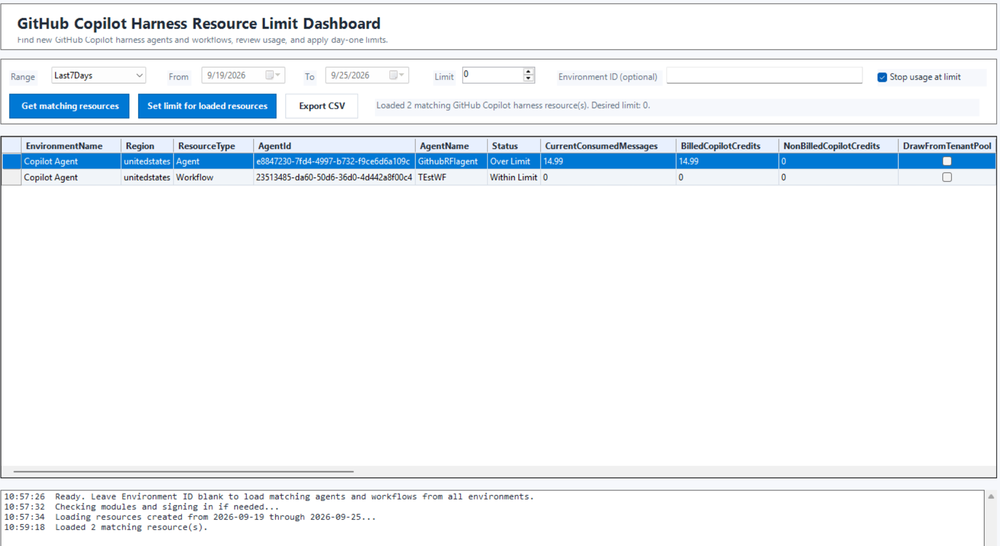

# GitHub Copilot Harness Resource Limit Dashboard

This tool helps Power Platform administrators find newly created GitHub Copilot harness agents and Copilot Studio workflows, then set their usage limit from day one.

## Why this is needed

When a new agent or workflow is created, its usage limit may not be set immediately. If that is missed, usage can start before the expected control is applied.

This script helps administrators regularly check newly created resources and apply:

- A message limit, such as `0`, `10`, or `15`
- **Turn off agent when usage reaches 100%**
- An audit CSV showing what was found and updated

## Three ways to use this tool

### Option 1: Run automatically with Windows Task Scheduler

Use this when you want the check to run every day or every week without opening the dashboard.

Example command:

```powershell
powershell.exe -NoProfile -ExecutionPolicy Bypass -File "C:\Path\To\GitHubCopilotHarnessResourceLimitDashboard.ps1" -RunMode ScheduledJob -Range Today -LimitValue 0 -AuditCsvPath "C:\CopilotHarnessLimitData\github-copilot-harness-resource-limits.csv"
```

Common schedules:

| Schedule | Suggested range |
|---|---|
| Daily | `-Range Today` |
| Weekly | `-Range Last7Days` |

Recommended audit/output folder:

```text
C:\CopilotHarnessLimitData
```

Keep generated CSV files and logs in this separate folder. Do not commit these files to GitHub.

### Option 2: Run manually with the GUI dashboard

Use this when an admin wants to review resources before applying limits.

Run either command:

```powershell
.\GitHubCopilotHarnessResourceLimitDashboard.ps1
```

```powershell
.\GitHubCopilotHarnessResourceLimitDashboard.ps1 -RunMode Gui
```

GUI output:



Then:

1. Select **Today**, **Last7Days**, or **Custom**.
2. Enter the limit value.
3. Keep **Stop usage at limit** checked if you want to turn off the agent when usage reaches 100%.
4. Leave **Environment ID** blank to check all environments, or enter one environment ID.
5. Click **Get matching resources**.
6. Review the grid.
7. Click **Set limit for loaded resources**.
8. Export the CSV if you want a manual audit copy.

### Option 3: Run from Microsoft Scout skill

Use this when the admin is using Microsoft Scout desktop and wants to run the scheduled-job mode by prompt.

The skill file is included here:

```text
skills\github-copilot-harness-limit-scheduler\SKILL.md
```

To install the skill in Microsoft Scout:

1. Copy this folder:
   ```text
   skills\github-copilot-harness-limit-scheduler
   ```

2. Paste it into:
   ```text
   %USERPROFILE%\.scout\m-skills\github-copilot-harness-limit-scheduler
   ```

3. Open `SKILL.md` and update the script path if needed.

4. Restart Microsoft Scout, or refresh skills if available.

Example prompts:

```text
/github-copilot-harness-limit-scheduler run for today with limit 0
```

```text
/github-copilot-harness-limit-scheduler run for last 7 days with limit 15
```

```text
/github-copilot-harness-limit-scheduler open the GUI
```

Important: this works in **Microsoft Scout desktop** because it can run local PowerShell. A cloud-only cowork cannot open the local GUI or run a local script directly.

## Prerequisites

| Requirement | Details |
|---|---|
| Operating system | Windows |
| PowerShell | Windows PowerShell 5.1 or PowerShell 7 with Windows Forms support |
| Module | `Az.Accounts` |
| Role | Power Platform Administrator or equivalent permissions |
| Access | Access to target Power Platform environments and Copilot Studio resources |
| Network | Access to Microsoft sign-in, Power Platform, Dataverse, and licensing APIs |

The script checks for `Az.Accounts` and installs it for the current user if it is missing.

## Useful parameters

| Parameter | Example | Purpose |
|---|---|---|
| `-RunMode` | `Gui` or `ScheduledJob` | Choose dashboard or unattended run. |
| `-Range` | `Today`, `Last7Days`, `Custom` | Choose the resource creation window. |
| `-StartDate` | `2026-09-20` | Start date when using `Custom`. |
| `-EndDate` | `2026-09-24` | End date when using `Custom`. |
| `-LimitValue` | `0` | Message limit to apply. |
| `-StopUsageAtLimit` | `$true` | Turns off usage when the resource reaches 100% of the limit. |
| `-AuditCsvPath` | `C:\CopilotHarnessLimitData\limits.csv` | Where to save the audit CSV. |
| `-EnvironmentId` | optional | Leave blank for all environments, or set one environment ID. |

## Files

| File | Purpose |
|---|---|
| `GitHubCopilotHarnessResourceLimitDashboard.ps1` | Main script for GUI and scheduled-job runs. |
| `README.md` | Setup and usage instructions. |
| `SECURITY.md` | Security and data-handling guidance. |
| `.gitignore` | Prevents local exports and logs from being committed. |
| `skills\github-copilot-harness-limit-scheduler\SKILL.md` | Microsoft Scout skill instructions. |
| `docs\images\gui-dashboard.png` | Screenshot of the GUI dashboard. |

## Safety notes

- Validate in a limited scope before broad use.
- Review audit CSV files after scheduled runs.
- Store audit data in a separate local folder such as `C:\CopilotHarnessLimitData`.
- Do not commit generated CSV files, logs, or tenant-specific exports to GitHub.
- Run scheduled tasks under an account with the required Power Platform permissions.
